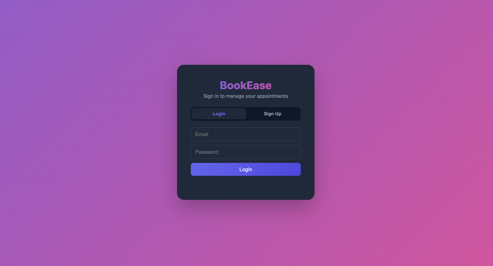
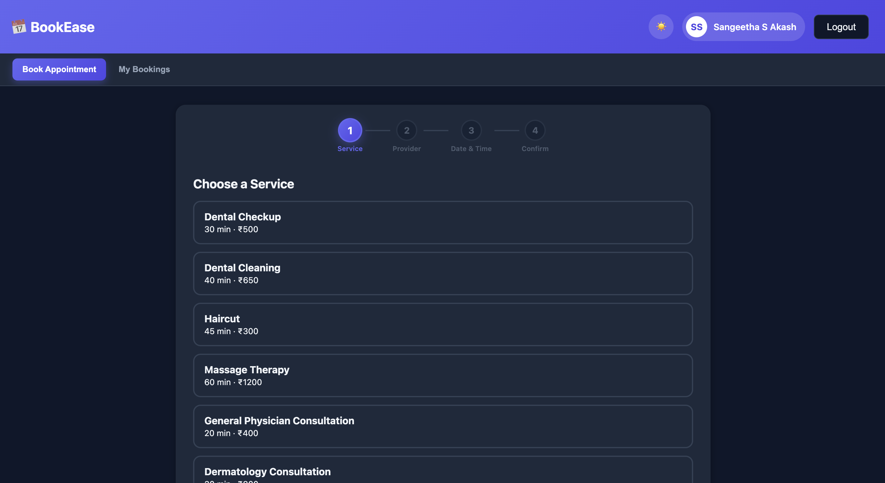
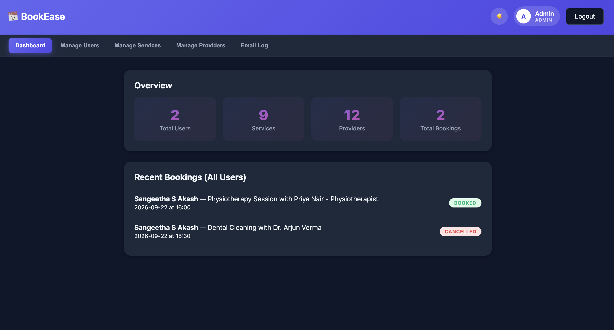

# BookEase — Appointment Booking Platform

A full-stack appointment booking platform built from scratch with vanilla JavaScript, jQuery, Vercel Serverless Functions, and Supabase (PostgreSQL). Supports customer booking flows and a complete admin management dashboard, with real database-level safeguards against double-booking.

**Live demo:** [add your Vercel URL here once deployed]

---

## Features

### Customer-facing
- Email/password signup and login with hashed passwords (bcrypt)
- Step-by-step booking wizard: choose a service → choose a provider → pick a date & time → confirm
- Real-time slot availability, generated from provider working hours minus existing bookings
- Booking confirmation screen with contact details and next-step actions
- "My Bookings" view with cancellation support
- Light/dark theme toggle (persisted across sessions)

### Admin dashboard
- Role-based access control (`user` vs `admin`)
- Live stats overview: total users, services, providers, bookings
- User management (view, delete)
- Service management (add, edit, delete, categorize)
- Provider management with many-to-many service assignment
- Simulated email notification log for booking confirmations
- Search and pagination across all admin list views
- Category filtering for services

### Data integrity & security
- Passwords hashed with bcrypt, never stored or returned in plain text
- Double-booking prevented at **two levels**:
  - Application-level availability checks before insert
  - A PostgreSQL `unique` constraint on `(provider_id, appointment_date, appointment_time)` as a database-level guarantee, even under race conditions
- Every admin API route independently re-verifies the requester's role server-side — admin status is never trusted from the client
- Environment variables (Supabase keys) are never committed to the repository

---

## Tech Stack

| Layer | Technology |
|---|---|
| Frontend | HTML5, CSS3 (custom design system, CSS variables for theming), vanilla JavaScript, jQuery |
| Backend | Vercel Serverless Functions (Node.js, ES Modules) |
| Database | PostgreSQL via Supabase |
| Auth | bcrypt password hashing, `localStorage`-based session persistence |
| Hosting | Vercel |
| Version control | Git & GitHub |

**Why this stack:** Vercel Serverless Functions provide a lightweight REST API without needing to run or manage a dedicated backend server, and Supabase provides a fully managed Postgres database with a generous free tier — letting the whole app deploy and run at zero cost while still demonstrating real relational database design and backend logic.

---

## Screenshots

```



```

---

## Database Schema

Four core relational tables plus a join table for many-to-many provider/service relationships:

- **`users`** — id, name, email, password_hash, phone, role, created_at
- **`services`** — id, name, duration_minutes, price, category, created_at
- **`providers`** — id, name, created_at
- **`provider_services`** — join table linking providers ↔ services (many-to-many)
- **`appointments`** — id, user_id, provider_id, service_id, appointment_date, appointment_time, contact_phone, status, created_at
- **`notification_logs`** — id, recipient_email, subject, message, type, created_at

Key design decisions:
- Foreign keys with `on delete cascade` to keep referential integrity
- `check` constraints on `appointments.status` and `users.role` to restrict values at the database level
- A `unique` constraint on `(provider_id, appointment_date, appointment_time)` in `appointments` to make double-booking physically impossible, not just application-checked

---

## Project Structure

```
appointment-booking/
├── api/
│   ├── signup.js
│   ├── login.js
│   ├── services.js
│   ├── providers.js
│   ├── availability.js
│   ├── book.js
│   ├── my-bookings.js
│   ├── admin-users.js
│   ├── admin-services.js
│   ├── admin-providers.js
│   ├── admin-stats.js
│   └── admin-notifications.js
├── public/
│   ├── index.html
│   ├── style.css
│   └── app.js
├── .env                 (not committed — see setup below)
├── .gitignore
├── package.json
└── README.md
```

---

## Local Setup

### Prerequisites
- Node.js 20.x (Node 22 is not currently compatible with the `vercel dev` routing used in this project)
- A free [Supabase](https://supabase.com) account
- A free [Vercel](https://vercel.com) account
- [Vercel CLI](https://vercel.com/docs/cli) installed globally: `npm install -g vercel`

### 1. Clone the repository
```bash
git clone https://github.com/YOUR_USERNAME/appointment-booking-platform.git
cd appointment-booking-platform
```

### 2. Install dependencies
```bash
npm install
```

### 3. Set up the database
1. Create a new project in Supabase
2. Open the SQL Editor and run the schema creation scripts (see `/database/schema.sql` if included, or recreate the tables listed under **Database Schema** above)
3. Copy your **Project URL** and **service_role key** from Project Settings → API

### 4. Configure environment variables
Create a `.env` file in the project root:
```
SUPABASE_URL=https://your-project.supabase.co
SUPABASE_SERVICE_ROLE_KEY=your_service_role_key_here
```

### 5. Run locally
```bash
nvm use 20
vercel dev
```
Visit `http://localhost:3000`

---

## Deployment

This project is deployed on Vercel:

1. Push the repository to GitHub
2. Import the repository into Vercel
3. Add the same environment variables (`SUPABASE_URL`, `SUPABASE_SERVICE_ROLE_KEY`) in the Vercel project settings
4. Deploy — Vercel automatically builds and serves the `api/` functions and `public/` static files

---

## Known Limitations & Possible Improvements

This was built as a learning-focused portfolio project, with a few deliberate simplifications worth noting:

- **Session management** uses `localStorage` rather than server-side sessions or JWTs — sufficient for a demo, but a production app would use proper token-based auth
- **Email notifications are simulated** — logged to the database and viewable in the admin panel, but no real emails are sent
- **Provider working hours are fixed** (9 AM–5 PM, 30-minute slots) rather than configurable per provider
- Possible future additions: configurable provider schedules, recurring appointments, real email delivery (e.g. via Resend), booking reminders, CSV export for admin reports

---

## Author

Built by Sangeetha Sakash as a hands-on full-stack portfolio project, focused on real relational database design, working backend logic, and a polished, functional UI — not just static mockups.
